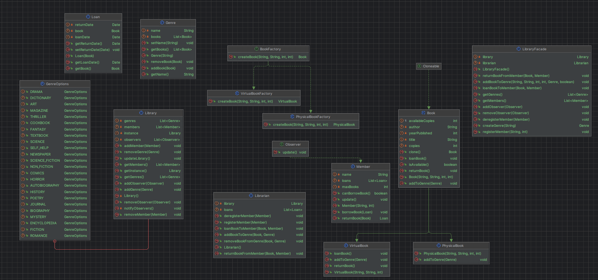

# UML:


## Library Management System Briefing
### Classes and Methods
### Library (Singleton, Observer)
#### Fields:
``` java
private static Library instance: Singleton instance.
private List<Genre> genres: List of genres in the library.
private List<Member> members: List of members.
private List<Observer> observers: List of observers.
```
#### Methods:
``` java
public static synchronized Library getInstance(): Returns the singleton instance.
public void addGenre(Genre genre): Adds a genre to the library and notifies observers.
public void removeGenre(Genre genre): Removes a genre from the library and notifies observers.
public Genre getGenre(GenreOptions genre): Returns a genre based on an enum option.
public void addObserver(Observer observer): Adds an observer to the list.
public void removeObserver(Observer observer): Removes an observer from the list.
public void addMember(Member member): Adds a member to the library and registers them as an observer.
public void removeMember(Member member): Removes a member from the library and deregisters them as an observer.
private void notifyObservers(): Notifies all observers of changes.
public void updateLibrary(): Updates the library and notifies observers.
```
### Librarian (Facade)

#### Fields:
``` java
private Library library: Instance of the library.
private List<Loan> loans: List of current loans.
```
#### Methods:
``` java
public Librarian(): Constructor that initializes the library and loan list.
public void addBookToGenre(Book book, Genre genre): Adds a book to a genre and updates the library.
public void removeBookFromGenre(Book book, Genre genre): Removes a book from a genre and updates the library.
public void registerMember(Member member): Registers a member and updates the library.
public void deregisterMember(Member member): Deregisters a member and updates the library.
public void loanBookToMember(Book book, Member member): Loans a book to a member if available and updates the library.
public void returnBookFromMember(Book book, Member member): Returns a book from a member and updates the library.
```
### LibraryFacade (Facade)
#### Fields:
``` java
private Library library: Instance of the library.
private Librarian librarian: Instance of the librarian.
```
#### Methods:
``` java
public LibraryFacade(): Constructor that initializes the library and librarian.
public void registerMember(String name, int maxBooks): Registers a member.
public void deregisterMember(Member member): Deregisters a member.
public void addBookToGenre(String title, String author, int yearPublished, int copies, Genre genre, boolean isPhysical): Adds a book to a genre.
public void loanBookToMember(Book book, Member member): Loans a book to a member.
public void returnBookFromMember(Book book, Member member): Returns a book from a member.
public Genre createGenre(String name): Creates a genre.
public void addObserver(Observer observer): Adds an observer to the library.
public void removeObserver(Observer observer): Removes an observer from the library.
public List<Genre> getGenres(): Returns the list of genres in the library.
public List<Member> getMembers(): Returns the list of members in the library.
```
### Genre
#### Fields:
``` java
private List<Book> books: List of books in the genre.
private String name: Name of the genre.
```
#### Methods:
``` java
public Genre(String name): Constructor that initializes the genre with a name.
public String getName(): Returns the genre name.
public void setName(String name): Sets the genre name.
public void addBook(Book book): Adds a book to the genre.
public void removeBook(Book book): Removes a book from the genre.
public List<Book> getBooks(): Returns the list of books in the genre.
```
### Book (Prototype)

#### Fields:
``` java
private String title: Title of the book.
private String author: Author of the book.
private int yearPublished: Year the book was published.
private int copies: Number of copies available.
protected int availableCopies: Number of copies available for loan.
```
#### Methods:
``` java
public Book(String title, String author, int yearPublished, int copies, Genre genre): Constructor that initializes the book and adds it to a genre.
public boolean isAvailable(): Returns the availability status of the book.
public void loanBook(): Loans the book. (updates available copies)
public void returnBook(): Returns the book. (updates available copies)
@Override public Book clone(): Creates and returns a clone of the book.
```
### PhysicalBook (Concrete Prototype)
#### Methods:
``` java
public PhysicalBook(String title, String author, int yearPublished, int copies): Constructor that initializes a physical book.
@Override public void addToGenre(Genre genre): Adds the book to a genre.
```
### VirtualBook (Concrete Prototype)
#### Methods:
``` java
public VirtualBook(String title, String author, int yearPublished, int copies): Constructor that initializes a virtual book.
@Override public void addToGenre(Genre genre): Adds the book to a genre.
@override public void loanBook(): Loans the book. (dont updates available copies)
@override public void returnBook(): Returns the book. (dont updates available copies)
```

### BookFactory (Factory Method)

#### Methods:
``` java
public abstract Book createBook(String title, String author, int yearPublished, int copies): Abstract method to create a book.
```
### PhysicalBookFactory (Concrete Factory)
#### Methods:
``` java
public Book createBook(String title, String author, int yearPublished, int copies): Creates and returns a physical book.
```
### VirtualBookFactory (Concrete Factory)
#### Methods:
``` java
public Book createBook(String title, String author, int yearPublished, int copies): Creates and returns a virtual book.
```
### Member (Observer)

#### Fields:
``` java
private String name: Name of the member.
private List<Loan> loans: List of books currently on loan.
private int maxBooks: Maximum number of books the member can borrow.
```
#### Methods:
``` java
public Member(String name, int maxBooks): Constructor that initializes the member with a name and max books limit.
public boolean canBorrowBook(): Checks if the member can borrow more books.
public void borrowBook(Loan loan): Borrows a book for the member.
public Loan returnBook(Book book): Returns a book from the member.
@Override public void update(): Updates the member (Observer pattern method).
```
### Loan

#### Fields:
``` java
private Book book: Book being loaned.
private Date loanDate: Date the book was loaned.
private Date returnDate: Date the book was returned.
```
#### Methods:
``` java
public Loan(Book book): Constructor that initializes the loan with a book and sets the loan date to the current date.
public Book getBook(): Returns the book being loaned.
public Date getLoanDate(): Returns the loan date.
public Date getReturnDate(): Returns the return date.
public void setReturnDate(Date returnDate): Sets the return date.
```

## Design Patterns Used
#### Singleton Pattern:
Ensures only one instance of the Library class exists.
#### Observer Pattern:
Used to notify members (observers) of changes in the library.
#### Facade Pattern:
Simplifies interactions with the library system through the Librarian class.
#### Prototype Pattern: 
Allows cloning of Book instances.
#### Factory Method Pattern: 
Used to create instances of Book through PhysicalBookFactory and VirtualBookFactory.
